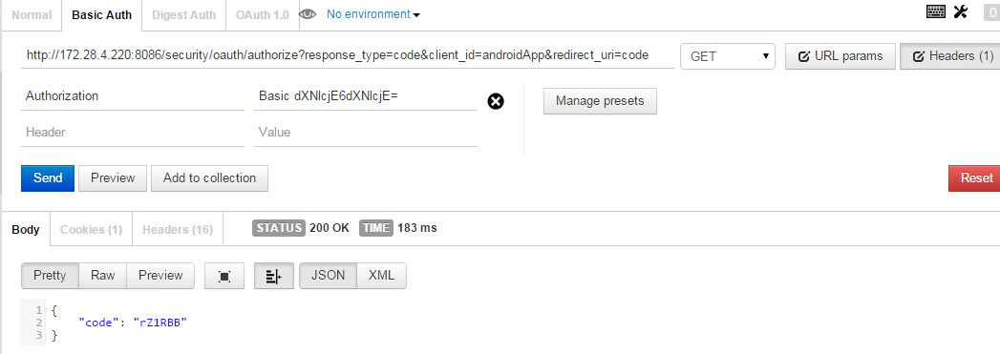

# Oauth2服务 #

## Features ##
    1. 提供oauth2协议api
    2. 提供apikey增删查改api
    3. 提供userdetails增删查改api

----------

## 访问oauth2保护的资源 ##
###1. 请求code : 
#### * 使用Basic authentication 的方式：
	1. curl -u user_name:user_password http://172.28.4.220:8086/security/oauth/authorize?response_type=code&client_id=androidApp&redirect_uri=code
                
	2.  成功后将在response里面返回code
        
    如：{
    "code": "Afoed2"
	}

#### * 使用Form login 的方式：
	1. 浏览器访问  
	http://172.28.4.220:8086/security/oauth/authorize?response_type=code&client_id=webApp&redirect_uri=/guanhutong3g/index
		    
	
	2. 输入用户名和密码,点击登陆，
		    
	3. 重定向成功后在链接里得到code,浏览器地址栏
	如: http://example.com/guanhutong3g/index?code=YlsoCM

###2. 请求Access token: 
	1. curl app_key:app_secret -X POST http://172.28.4.220:8086/security/oauth/token?code=your_code&grant_type=authorization_code&redirect_uri=your_redirect_uri
	
	
	2.  response
		{
	    "access_token": "7a9609a8-9693-4eff-b522-5106944ec21b",
	    "token_type": "bearer",
	    "expires_in": 19159,
	    "scope": "read write"
		}
  
  
###3. 请求Access token 详情:
	1.	curl http://172.28.4.220:8086/security/oauth/check_token?token=your_access_token
	
	
	2.  response
	
		{
	    "exp": 1433339504,
	    "user_name": "user1",
	    "scope": [
	        "read",
	        "write"
	    ],
	    "authorities": [
	        "USER"
	    ],
	    "client_id": "webApp"
		}

###4. 使用Access Token访问受保护的WS API:
	1. curl -H "X-Token:your_access_token" http://172.28.4.220:8086/groups
	
	
	2.  response
	
		{
	    "_links": {
	        "next": {
	            "href": "http://localhost/groups?page=1&size=20"
	        },
	        "self": {
	            "href": "http://localhost/groups{?page,size,sort}",
	            "templated": true
	        }
	    },
		.......
		}

###5. 退出登录:

	curl X POST http://172.28.4.220:8086/security/logout

###6. 快速获取Access token:
	1.	curl -H "Content-Type:application/json" http://172.28.4.220:8086/security/oauth/accesstoken -d {"loginName" : "user1","password": "user1"}
	
	
	2.  response
	
		{
        	    "access_token": "7a9609a8-9693-4eff-b522-5106944ec21b",
        	    "token_type": "bearer",
        	    "expires_in": 19159,
        	    "scope": "read write"
        }
    3. 如果认证失败，返回401

###7. 使用Access token获取用户uuid:

	1. curl -H "X-Token:your_access_token" http://172.28.4.220:8086/security/users/myInfo

    2.  response

        {
            "uuid": "1",
            "name": "user1",
            "links": []
        }

----------

## User Rest 服务 ##

### 1. 查询用户 ###

	curl http://172.28.4.220:8086/security/users
	curl http://172.28.4.220:8086/security/users/8a89aa684dbc8cf4014dbc91cc820001

### 2. 新增用户 ###

	curl -X POST http://172.28.4.220:8086/security/users -d {"loginName": "user4","password": "user4","roles" : ["roles/1"]}

### 3. 修改用户 ###

	curl -X PATCH http://172.28.4.220:8086/security/users/8a89aa684dbc8cf4014dbc91cc820001 -d {"password": "user4","roles" : ["roles/1"]}

### 4. 删除用户 ###

	curl -X DELETE http://172.28.4.220:8086/security/users/8a89aa684dbc8cf4014dbc91cc820001

----------

## Role Rest 服务 ##

### 1. 查询角色 ###

	curl http://172.28.4.220:8086/security/roles
	curl http://172.28.4.220:8086/security/roles/1

### 2. 新增角色 ###

	curl -X POST http://172.28.4.220:8086/security/roles -d {"name": "ADMIN"}

### 3. 修改角色 ###

	curl -X PATCH http://172.28.4.220:8086/security/roles/1 -d {"name": "ADMIN"}

### 4. 删除角色 ###

	curl -X DELETE http://172.28.4.220:8086/security/roles/1

----------

## APP Rest 服务 ##

### 1. 查询APP ###

	curl http://172.28.4.220:8086/security/apps
	curl http://172.28.4.220:8086/security/apps/1

### 2. 新增APP ###

	curl -X POST http://172.28.4.220:8086/security/apps -d {"clientId": "webApp",
                "clientSecret": "webApp", "scope": "read,write",
                "grantTypes": "authorization_code",
                "redirectUri": "","autoApprove": "true",}

### 3. 修改APP ###

	curl -X PATCH http://172.28.4.220:8086/security/apps/1 -d {"clientSecret": "webApp", "redirectUri": "code"}

### 4. 删除APP ###

	curl -X DELETE http://172.28.4.220:8086/security/apps/1

----------

## 用户注册服务 ##

### 1. 关护通用户注册 ###

	curl -X POST http://172.28.4.220:8086/security/guanhutong3g/register -d {"loginName": "user5","password": "user5", "checkCode": ""}

### 2. 用户修改密码 ###

	curl -X POST http://172.28.4.220:8086/security/users/password.update -d {"loginName": "user5", "oldPassword": "user5", "newPassword": "user9"}

### 3. 管理员重置密码 ###

	curl -X POST http://172.28.4.220:8086/security/users/password.reset -d {"loginName": "user6", "password": "user6"}

### 4. 管理员修改用户角色 ###

	curl -X POST http://172.28.4.220:8086/security/users/roles.update -d {"loginName": "user6", "roleNames": ["ADMIN", "USER"]}

### 5. 检查登录名 ###

	curl http://172.28.4.220:8086/security/users/checkloginname?loginname=xxx

	response status:
	200 表示可用，400 表示不可用